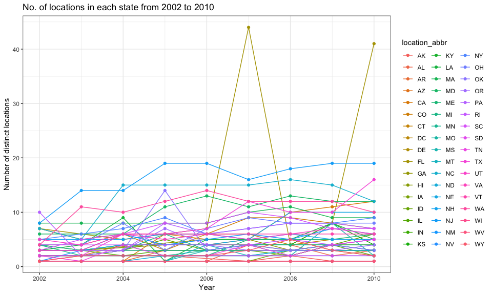

p8105\_hw3\_pm2995
================
Priyal
10/8/2018

Problem 1
=========

Problem 1.1
-----------

Loading the data and some cleaning

First we load the BRFSS data from the `p8105.datasets` package.

``` r
data(brfss_smart2010)
```

Next, we do some cleaning to ensure appropriate variable names. I cleaned the data using janitor:: clean\_names function converting them all to lower snake case, filter to include only overall health topic data and include responses from excellent to poor. Further, I organized the responses as a factor taking levels ordered from excellent to poor using mutate.

``` r
brfss_tidy = brfss_smart2010 %>% 
  janitor::clean_names() %>%
  filter(topic == "Overall Health") %>%
  filter(response %in% c("Excellent", "Very good", "Good", "Fair", "Poor")) %>% 
  rename(location_abbr = locationabbr, location_desc = locationdesc) %>%
  mutate(response = as.factor(response)) %>% 
  mutate(
    response = fct_relevel(response, c("Excellent", "Very good", "Good", "Fair", "Poor"))
    )
```

Specific Questions

Problem 1.2
-----------

In 2002, which states were observed at 7 locations?

Answer: The code chunk below filters to include the rows from year 2002 and groups the data by location\_abbr (which includes states). Further, using summarize number of distinct locations in each state has been taken out. I have used filter to keep states that were observed at 7 locations.

``` r
brfss_tidy %>% 
  filter(year == 2002) %>% 
  group_by(location_abbr) %>% 
  summarize(n_locations = n_distinct(location_desc)) %>% 
  filter(n_locations == 7)
## # A tibble: 3 x 2
##   location_abbr n_locations
##   <chr>               <int>
## 1 CT                      7
## 2 FL                      7
## 3 NC                      7
```

Three states were observed at seven locations: CT, FL, and NC.

Problem 1.3
-----------

Make a “spaghetti plot” that shows the number of locations in each state from 2002 to 2010.

Answer: The code below groups the brfss\_tidy data by location\_abbr(state) and year and further uses summarize to take out the number of corresponding observations. It then creates a spaghetti plot that shows the number of locations in each state from 2002 to 2010.

``` r
brfss_tidy %>% 
  group_by(location_abbr, year) %>% 
  summarize(n_obs = n()) %>% 
  ggplot(aes(x = year, y = n_obs, color = location_abbr)) +
  geom_line() + labs(title = "No. of locations in each state from 2002 to 2010", x = "Year", y = "Number of observations") + theme(legend.position = "right")
```



There is a lot of clumping in this plot and peaks can be seen for the state of Florida for the year 2007 and 2010. Also, it can be seen that for NJ there were consistent number of locations from 2005 to 2006 and then from 2009 to 2010.

Problem 1.4
===========

Make a table showing, for the years 2002, 2006, and 2010, the mean and standard deviation of the proportion of “Excellent” responses across locations in NY State.

Answer: The code below filters to keep the rows for the years 2002,2006 and 2010, Excellent response and for NY state. Further, it uses group\_by function to group by the year and summarize to compute mean and standard deviations of for those years. The result is presented in the form of a table using knitr::kable.

``` r
brfss_tidy %>%
  filter(year %in% c("2002", "2006", "2010")) %>% 
  filter(response == "Excellent") %>% 
  filter(location_abbr == "NY") %>% 
  group_by(year) %>% 
  summarize(mean_excellent = mean(data_value, na.rm = TRUE), sd_excellent = sd(data_value, na.rm = TRUE)) %>% 
  knitr::kable(digits = 1)
```

|  year|  mean\_excellent|  sd\_excellent|
|-----:|----------------:|--------------:|
|  2002|             24.0|            4.5|
|  2006|             22.5|            4.0|
|  2010|             22.7|            3.6|

There is not much difference in the mean proportion for the excellent response for the years 2006 and 2010, whereas the mean proportion for the excellent response is a bit different in the year 2002.

Problem 1.5
===========

For each year and state, compute the average proportion in each response category (taking the average across locations in a state). Make a five-panel plot that shows, for each response category separately, the distribution of these state-level averages over time.

Answer: The code below makes a five panel plot that shows the distribution of state level averages over time for each response category separately. To compute the average proportion in each category for each year and state, I have grouped the data by year, location\_abbr(state) and response and further made the five panel plot by using facet grid to separate out each response category.

``` r
brfss_tidy %>% 
  group_by(year,location_abbr,response) %>% 
  summarize(average = mean(data_value, na.rm = TRUE)) %>% 
  ggplot(aes(x = year, y = average, color = response)) + 
  geom_point() + 
  facet_grid(~ response) +
  labs(title = "Distribution of State Level Averages Over Time", x = "Year", y = "Mean Proportions") +
  theme(axis.text.x = element_text(angle = 90, hjust = 1))
```


The distribution of state level averages over time suggest that the response "very good" was observed the most over the years and the response "poor" was observed the least.

Problem 2
=========

Loading the dataset

Let's load the data from the `p8105.datasets` package.

``` r
data("instacart")
```

Problem 2.1
-----------

Description of the dataset

There are 1384617 rows and 15 columns. All the variables of the dataset of class integer except eval\_set, product\_name, aisle, and department which are character. Let us take the example of `order_id` 1 that was placed by the `user_id` 112108. For every product there is a `product_id`, `product_name`. The product location is determined by four variables: `aisle_id`, `aisle`, `department_id` and `department`. Taking the example of yoghurt aisle; it has aisle\_id 120, it belongs to dairy eggs department which has departemnt\_id 16. In this case the total number of items that were added were 8; the order in which they were added can be seen from the `add_to_cart_order`(eg. if this field is 2 it means this is the 2nd item that was added to the cart). Out of these 8 items the items that are being reordered can be seen as `reordered` = 1. `order_number` denotes the order sequence of the user; in this case it is this user's 4th order with instacart. `order_dow` and `order_hour_of_day` give us the details about when that order was placed. For this customer, he placed the order on Thursday(considering 0 as sunday) at 10 am. `days_since_prior_order` gives the number of days that have past since the previous order by this user. If this is the first order for a customer, this field will be NA. For this particular customer, nine days have passes since he/she placed the last order. `eval_set` refers to which evaluation set this order belongs in. In this dataset all belong to train `eval_set`.

Problem 2.2
-----------

How many aisles are there, and which aisles are the most items ordered from?

The code chunks below will give the total number of aisles

``` r
instacart %>% 
  distinct(aisle) %>% 
  nrow()
## [1] 134
```

The total number of aisles are 134.

The code chunk below will arrange the aisles as per descending order of their count which will enable us to see the aisle from which the most items are ordered.

``` r
instacart %>% 
  count(aisle) %>% 
  arrange(desc(n))
## # A tibble: 134 x 2
##    aisle                              n
##    <chr>                          <int>
##  1 fresh vegetables              150609
##  2 fresh fruits                  150473
##  3 packaged vegetables fruits     78493
##  4 yogurt                         55240
##  5 packaged cheese                41699
##  6 water seltzer sparkling water  36617
##  7 milk                           32644
##  8 chips pretzels                 31269
##  9 soy lactosefree                26240
## 10 bread                          23635
## # ... with 124 more rows
```

Most of the items are ordered from the fresh vegetables aisle followed by fresh fruits and packaged vegetable fruits.
